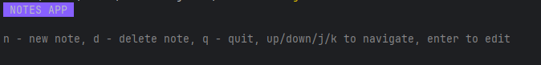
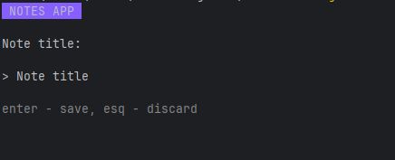
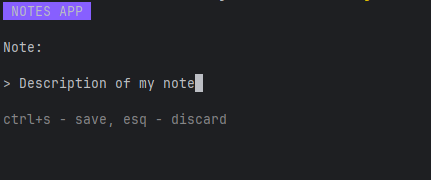
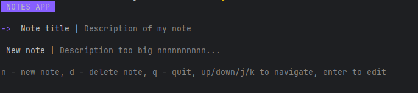
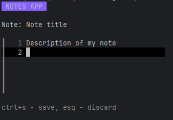

# 📝 Bubble TUI Notes App

> A clean, terminal-based note-taking application built with Go and Bubble Tea TUI framework

[](https://golang.org/)
[](https://sqlite.org/)
[](https://github.com/charmbracelet/bubbletea)

---

## 📸 Screenshots

<div align="center">
  <table>
    <tr>
      <td align="center">
        
        <br/>
        <strong>Empty list</strong>
      </td>
      <td align="center">
        
        <br/>
        <strong>Create New Note Title</strong>
      </td>
    </tr>
    <tr>
      <td align="center">
        
        <br/>
        <strong>Create New Note Description</strong>
      </td>
      <td align="center">
        
        <br/>
        <strong>Navigation Interface</strong>
      </td>
    </tr>
    <tr>
      <td align="center">
        
        <br/>
        <strong>Edit Note</strong>
      </td>
    </tr>
  </table>
</div>

---

## ✨ Features

- **🖥️ Terminal-based Interface** - Clean, distraction-free note-taking in your terminal
- **📚 Note Management** - Create, edit, and browse notes with intuitive navigation
- **💾 SQLite Storage** - Persistent local storage with SQLite database
- **⌨️ Keyboard Navigation** - Fully keyboard-driven interface with vim-like bindings
- **🎨 Styled Interface** - Beautiful terminal UI with syntax highlighting
- **🔄 Real-time Editing** - Smooth text editing with multi-line support

---

## 🛠️ Tech Stack

| Technology | Purpose |
|------------|---------|
| **Go 1.24+** | Core programming language |
| **Bubble Tea** | Terminal UI framework |
| **Bubbles** | UI components (textarea, textinput) |
| **Lipgloss** | Terminal styling and layout |
| **SQLite** | Local database storage |

---

## 🚀 Getting Started

### 📋 Prerequisites

- **Go 1.24+** installed on your system
- **SQLite3** (included with go-sqlite3 driver)

### 🔧 Installation

1. **Clone the repository**
   ```bash
   git clone https://github.com/kevinfjq/bt-notes-list.git
   cd bt-notes-list
   ```

2. **Install dependencies**
   ```bash
   go mod tidy
   ```

3. **Run the application**
   ```bash
   go run .
   ```

### 🏗️ Building

To build a standalone executable:

```bash
go build -o notes-app
./notes-app
```

---

## Usage

### 📝 Navigation & Controls

#### **Main View (Notes List)**
- `↑/k` - Move up in the notes list
- `↓/j` - Move down in the notes list
- `n` - Create a new note
- `d` - Delet selected note
- `Enter` - Edit the selected note
- `q` or `Ctrl+C` - Quit the application

#### **Title Input View**
- `Enter` - Confirm title and proceed to body editing
- `Esc` - Cancel and return to main view

#### **Note Editing View**
- `Ctrl+S` - Save the note
- `Esc` - Cancel editing and return to main view
- Regular text editing controls for content

### 📁 Data Storage

- Notes are automatically saved to `notes.db` SQLite database
- Database is created automatically on first run
- Each note contains:
  - Unique ID (timestamp-based)
  - Title
  - Body content

---

## 🏗️ Project Structure

```
📦 bt-notes-list/
├── 📄 main.go          # Application entry point
├── 📄 model.go         # Bubble Tea model and state management
├── 📄 store.go         # SQLite database operations
├── 📄 view.go          # UI rendering and styling
├── 📄 go.mod           # Go module dependencies
├── 📄 go.sum           # Dependency checksums
├── 📄 .gitignore       # Git ignore rules
└── 📄 README.md        # This file
```

---

## 🎯 How It Works

1. **Launch** - Start the application to see your notes list
2. **Create** - Press `n` to create a new note, enter a title
3. **Edit** - Write your note content in the text area
4. **Save** - Press `Ctrl+S` to save your note
5. **Browse** - Navigate through your saved notes with arrow keys
6. **Manage** - Edit existing notes by selecting them and pressing `Enter`

---

## 🎨 Customization

The application's appearance can be customized by modifying the styles in `view.go`:

- `appNameStyle` - Header styling
- `faintStyle` - Subtle text styling
- `enumeratorStyle` - List item styling

